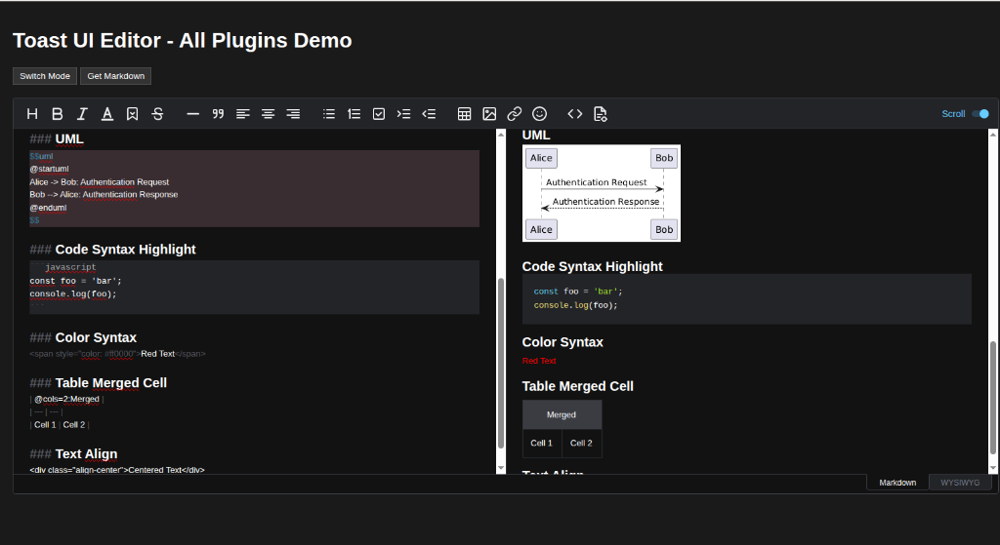
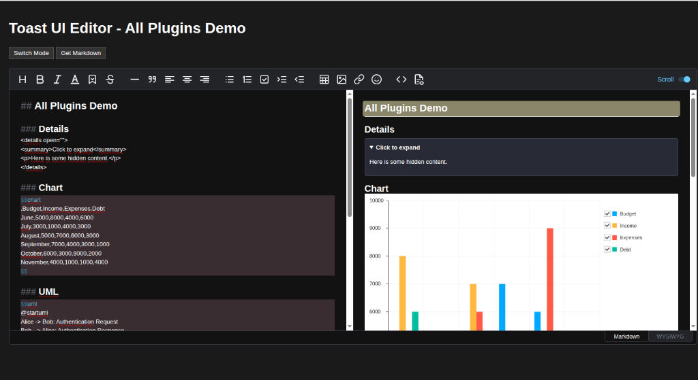
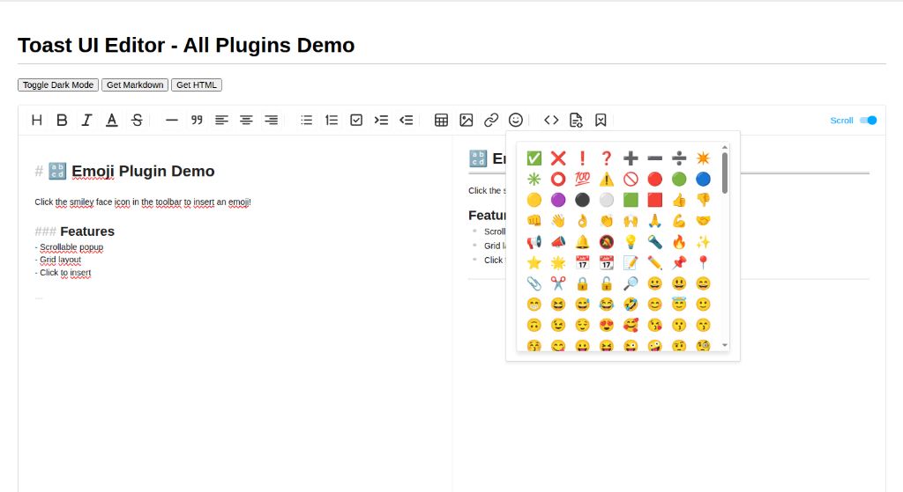

# @licium/editor

> A maintained fork of the [Toast UI Editor](https://github.com/nhn/tui.editor) focused on modern UI/UX, dark mode compatibility, and enhanced plugin support.

> [!NOTE]  
> **Project Realization**  
> This project was realized using **Vibe-Coding** and **Antigravity by [@google](https://github.com/google)**.


## 🚀 Overview

`@licium/editor` is a powerful, extensible Markdown and WYSIWYG editor. This fork revitalizes the original project with a focus on:
*   **Modern Aesthetics**: Refined iconography, spacing, and layout.
*   **Dark Mode First**: Comprehensive dark theme support across the editor and all plugins.
*   **Enhanced UX**: Improved toolbar organization, better shortcuts, and bug fixes.
*   **Plugin Ecosystem**: Maintained and rebranded plugins under the `@licium` scope.



## 📦 Packages

| Name | Description | Version |
| --- | --- | --- |
| [`@licium/editor`](./apps/editor) | Core JS Editor Component | [](https://www.npmjs.com/package/@licium/editor) |
| [`@licium/react-editor`](./apps/react-editor) | React Wrapper | [](https://www.npmjs.com/package/@licium/react-editor) |
| [`@licium/vue-editor`](./apps/vue-editor) | Vue Wrapper | [](https://www.npmjs.com/package/@licium/vue-editor) |

### Plugins

| Name | Description |
| --- | --- |
| [`@licium/editor-plugin-chart`](./plugins/chart) | Render Charts from code blocks |
| [`@licium/editor-plugin-code-syntax-highlight`](./plugins/code-syntax-highlight) | Syntax highlighting using Prism.js |
| [`@licium/editor-plugin-color-syntax`](./plugins/color-syntax) | Text color formatting |
| [`@licium/editor-plugin-table-merged-cell`](./plugins/table-merged-cell) | Table cell merging support |
| [`@licium/editor-plugin-uml`](./plugins/uml) | UML diagram rendering |
| [`@licium/editor-plugin-text-align`](./plugins/text-align) | **[NEW]** Text alignment (Left/Center/Right) |
| [`@licium/editor-plugin-text-align-simpel`](./plugins/text-align-simpel) | **[NEW]** Simple Text alignment (Left/Center only) |
| [`@licium/editor-plugin-details`](./plugins/details) | **[NEW]** Collapsible/spoiler blocks |
| [`@licium/editor-plugin-emoji`](./plugins/emoji) | **[NEW]** Emoji picker |
| [`@licium/editor-plugin-highlight`](./plugins/highlight) | **[NEW]** Text highlighting with color picker |



## ✨ Recent Updates (Jan 2026)

### 🎨 Visual & UI Refinements
- **Toolbar Layout Strategy**: Switched from `space-between` to `flex-start` (left-aligned) with fixed gaps (`15px`) to prevent dynamic jumping.
    -   Used CSS `:has()` selector to force the 'Scroll' toggle group to the far right.
- **Icon Updates**:
    -   **CodeBlock**: New "Document with Brackets" design.
    -   **Text Color**: Simplified "Underlined A" design.
    -   **Visibility Fixes**: Resolved visibility issues for Italic and UL icons in Light Mode.
    -   **Dark Mode Consistency**:
        -   **Emoji**: Added white stroke version for dark mode.
        -   **Strike & Task List**: Updated to new geometric designs (White Stroke) in Dark Mode.
        -   **Table**: Updated to white filled/outline version in Dark Mode.
    -   **Table Icon**: New "Outline with Header Row" design (Header + Grid) for better clarity.
    -   **Highlight & Color Syntax**: Unified "Light Blue" hover effects in Light Mode for a more polished feel.
- **Highlight Plugin Overhaul**:
    -   **Refactor**: Completely rewrote the plugin to use `tui-color-picker` (matching the Color Syntax plugin).
    -   **Inline Styles**: Switched from CSS classes (`.hl-red`) to inline styles (`background-color: #...`), allowing for **any** highlight color.
    -   **UI Polish**: Added "Reset" (Zurücksetzen) button and full internationalization support.

### 🖇️ Plugin Improvements
- **Details Plugin**:
    -   Fixed `Enter` key behavior (now correctly creates single new lines inside the block).
    -   Addressed nested content serialization data loss issues.
    -   Relocated "Collapsible Block" toolbar button to the "CodeBlock" group.
    -   **Critical Fixes**: Resolved initialization crashes and toggle interactivity issues in WYSIWYG mode.
- **Text Align Plugin**:
    -   Relocated buttons to the **Line / Blockquote** group for improved toolbar organization.
- **Emoji Plugin**:
    -   Added new emoji picker with scrollable grid and functional emoji priorities.



## 💾 Installation

```bash
npm install @licium/editor
```

## 📜 License

This software is licensed under the [MIT](./LICENSE).

## Acknowledgments & Credits

*   **[@google](https://github.com/google)**: For the power of **Vibe-Coding**, **Antigravity**, and **Gemini**, which transformed the development of this project.
*   **[@nhn](https://github.com/nhn) (Toast UI)**: For the excellent Markdown editor foundation.
